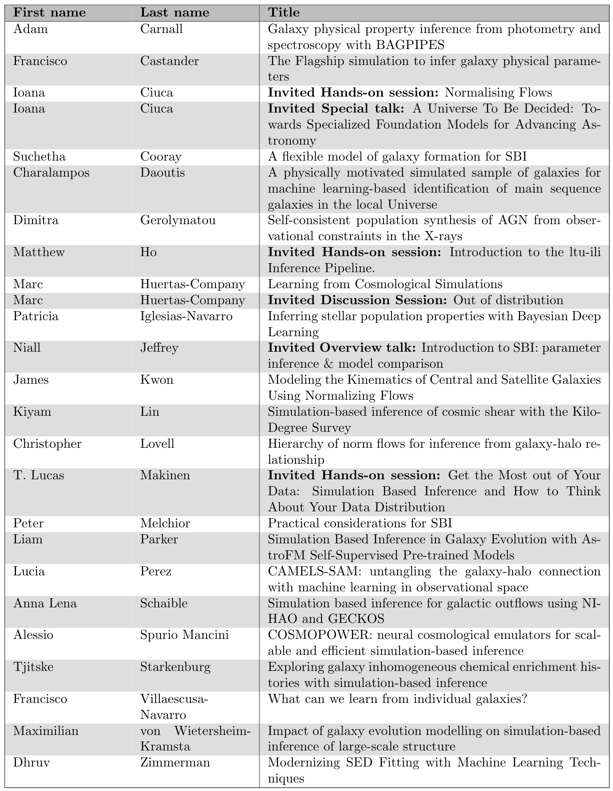

Inferring the physical parameters of galaxy populations from their observed properties is one of the key problems in galaxy evolution, and a necessary ingredient in many cosmological analyses. Typical approaches require an explicit or computable form of the likelihood, and significant computational resources. Simulation Based Inference (SBI) approaches circumvent this requirement, and when combined with machine learning methods, significantly reduce the computational cost of inference. Such approaches are necessary to process the millions to billions of sources from the latest generation of instruments. 

Simulation based inference is currently being applied to many astrophysical problems which face similar computing barriers. In this workshop, we aim to bring together both experts in SBI as well as galaxy evolution experts with SBI experience, to discuss problems and solutions faced when applying SBI to problems in galaxy evolution. This will be a small, focused meeting to enable plenty of time for discussion and practical sessions.

## Abstract Submission

<s>Submit your abstract here!~</s> **Closed**

## Registration

[Register here](https://shop.bris.ac.uk/conferences-and-events/school-of-physics/sbi-workshops/simulation-based-inference-for-galaxy-evolution-2024)

## Important Dates:

- <s>Abstract submission opens: 18 December 2023</s>

- <s>Abstract submission deadline: 19 January 2024</s>

- <s>Registration Opens: 16 February 2024</s>

- Registration Deadline: 29 March 2024

- Workshop: 9 - 12 April 2024

## Location: 
The meeting will be held in person at the School of Physics in Bristol, United Kingdom.

Further local information is provided [here](https://github.com/sbi-galev/2024/blob/main/local_info.md).
## Programme

## Contributions

[Download the Abstract Booklet](SBI_2024-abstract-booklet.pdf)

## Participants
| Name | Affilication |
| --- | --- |
|	Adam Carnall	|	University of Edinburgh	|
|	Anna Lena Schaible	|	Heidelberg University	|
|	Charalampos Daoutis	|	University of Crete	|
|	Chris Lovell	|	University of Portsmouth	|
| Dakshesh Kololgi | University College London |
|	Dan Leonte	|	Imperial College London	|
|	Dhruv Zimmerman	|	University of Florida	|
|	Francisco Castander	|	ICE-CSIC, IEEC	|
|	Francois Lanusse	|	Simons Foundation	|
|	Grant Stevens	|	University of Bristol	|
|	Hin Leung	|	University of St Andrews	|
|	Joshua Williamson	|	University College London	|
| Lucas Makinen | Imperial College London |
|	Marc Huertas-Company	|	Instituto de Astrofisica de Canarias	|
|	Matt Selwood	|	University of Bristol	|
|	Matthew Ho	|	Institut d'Astrophysique de Paris	|
|	Niall Jeffrey	|	University College London	|
|	Nicholas Boardman	|	University of St Andrews	|
|	Patricia Iglesias-Navarro	|	Instituto Astrofisica de Canarias	|
|	Sotiria Fotopoulou	|	University of Bristol	|
| Stephane Paltani | University of Geneva |
|	Teresa Matamoro Zatarain	|	University of Bristol	|

## Organizers: 
[S. Fotopoulou](https://www.sotiriafotopoulou.com) & [C. Lovell](http://www.christopherlovell.co.uk)

grp-sbi-galev-2024@groups.bristol.ac.uk

## SOC: 
* Johannes Buchner (MPE)
* Jo Ciuca (ANU)
* Carolina Cuesta-Lazaro (MIT/Harvard)
* Sotiria Fotopoulou (U Bristol; *co-chair*)
* Matt Ho (IAP)
* Kartheik Iyer (U Columbia)
* Niall Jeffrey (UCL)
* Christian Jespersen (Princeton U)
* Pablo Lemos (U Montreal)
* Christoper Lovell (U Portsmouth; *co-chair*)
* Lucas Makinen (Imperial College)
* Yuan-sen Ting (ANU)
* Mike Walmsley (U Toronto)

## LOC:

* Sotiria Fotopoulou
* Chris Lovell
* Matt Selwood
* Grant Stevens
* Teresa Matamoro Zatarain

